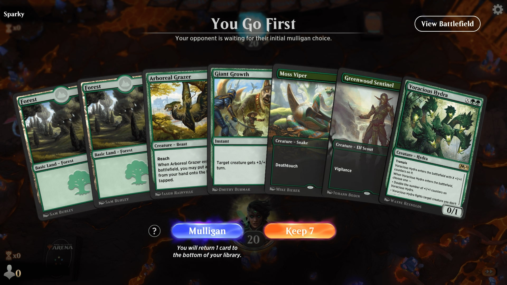
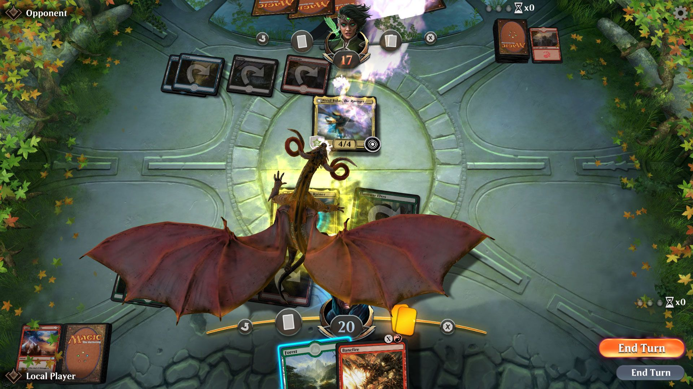

<p align="center"><i>Magic the Gathering Arena is a free-to-play digital collectible card game developed by Wizards of the Coast. The game is a digital adaption based on the Magic the Gathering card game, allowing players to gain cards through booster packs, in-game achievements, and build their own decks to challenge other players.</i>
</p>


## Dependencies

### Arch
```
sudo pacman -S wine jq curl
```

### Debian
```
sudo apt install wine jq curl
```

## Install Magic

❗❗ Do not change the folder paths from the Windows Installer ❗❗

```
git clone https://github.com/otti358/mtga-launcher.git
```
```
cd mtga-launcher/
```
```
./mtga-launcher
```

## Force Magic
```
./mtga-launcher --update 
```

## Sources

**[MTGA](https://magic.wizards.com/de/mtgarena)**

**[Wine](https://github.com/Kron4ek/Wine-Builds)**


## Gameplay







